# Dimensionfall:

Dimensionfall is a top-down real-time survival game set in a post-apocalyptic world. Survive in a strange place where you can visit multiple dimensions. Will you fight demons? Aliens? Zombies? Who knows what you will come across.

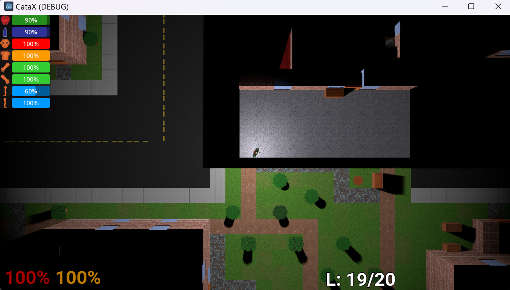

The world is infinite in every direction. Explore and survive as long as you can!

## How to play:
Until releases are shared on GitHub, you can play the game in the following way:
- Download [Godot](https://godotengine.org/download/) from their website or from [steam](https://store.steampowered.com/app/404790/Godot_Engine/)
- Download this project by going to the top-right of this page and clicking the green 'code' button and then click 'download zip'
- Extract the zip file to a location of your choosing
- Open Godot and click open project and navigate to the folder where you extracted the zip file
- Open the project in Godot and click 'play' in the top-right

## Features:
The game has the following features:

### Combat:
Ranged and melee combat are currently implemented. 
- One-handed weapons can be dual-wielded, while two-handed weapons will occupy both slots.
- Load and unload guns and magazines.
- Ammunition and other loot can be collected from enemy corpses.
- Increase your accuracy by gaining ranged combat skills and managing recoil.

### Inventory
- You have to manage weight and volume.
- You can drag and drop items from different containers
- Interact with your equipment slots

### Overmap
The game will create an infinite map to explore. The world is devided by regions, each having their own oppertunities and challenges. A marker will indicate your current location.

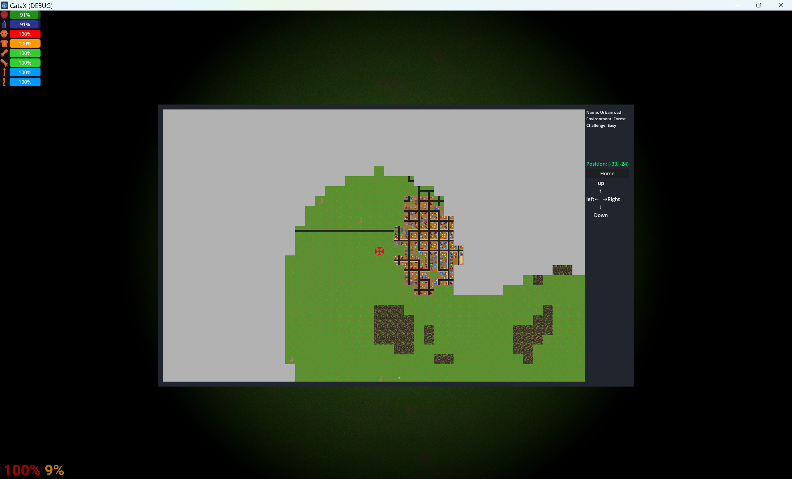

Cities and roads are generated. Explore a whole network of roads and get to know the area

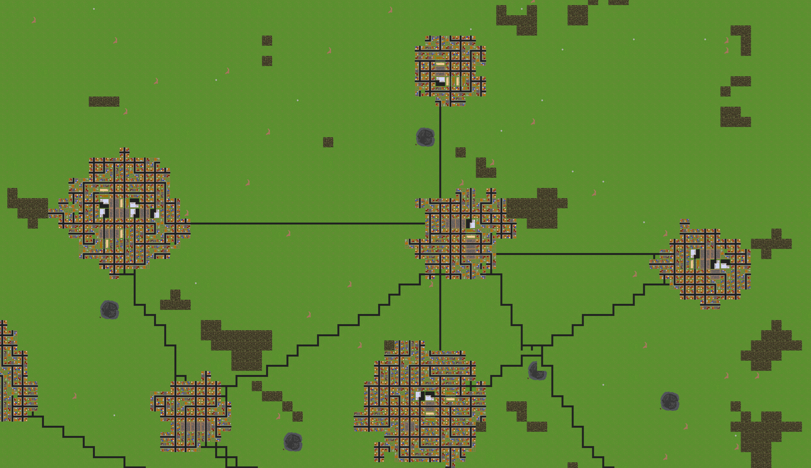

### Quest journal
Follow quests to guide your way trough this dangerous world. A quest may have multiple objectives, which will be displayed step-by-step

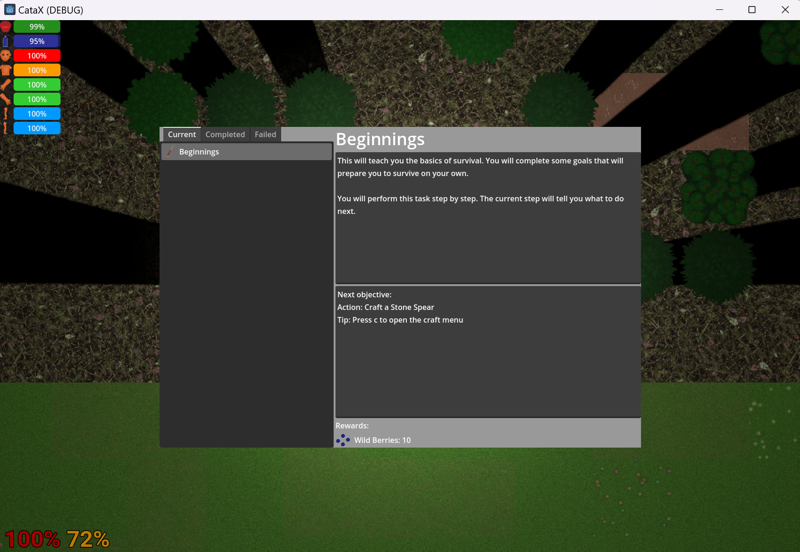

### Main menu
- Play the game
- Load a game
- Read documentation
- Manage content for the game
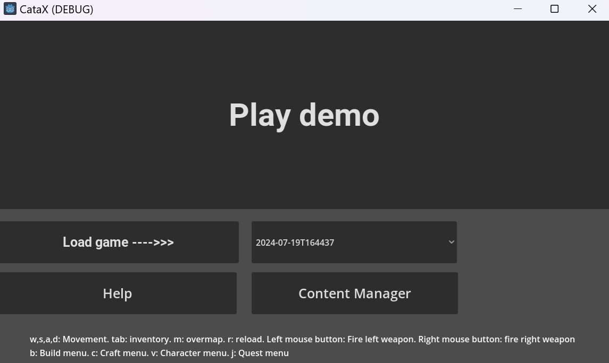

### Content editor
Content for this game is created in the content editor. On the left you can select content to edit. You can edit tacticalmaps, maps, items, tiles, furniture, mobs, itemgroups and wearable slots, skills and stats. 
- All content is saved as JSON, which allows you to edit the files manually or using an external editor if you want to.
- Content is loaded as mods, even the core content. Put all your json and sprites into /mods/yourmod/ and it can be read by the game (only core content is read at the moment, full mod support will be implemented)
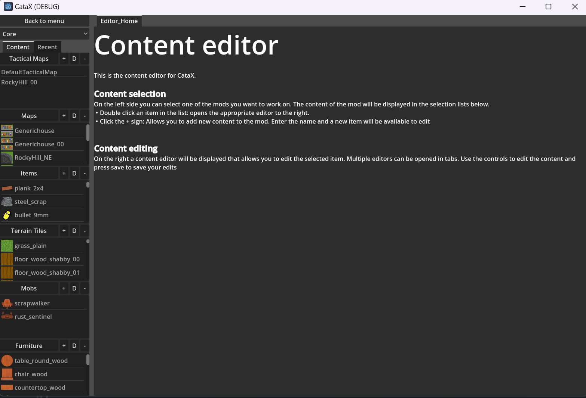

### Tacticalmap editor
A tacticalmap is made from maps and can be used to define a fixed area in the infinite world. This allows you to piece together a bigger map. You can specify any size and start filling the grid with maps from the selection on the right. The tiles in the grid can be rotated to properly connect roads and create symmetry. Tacticalmaps will spawn randomly on the map (not implemented yet)
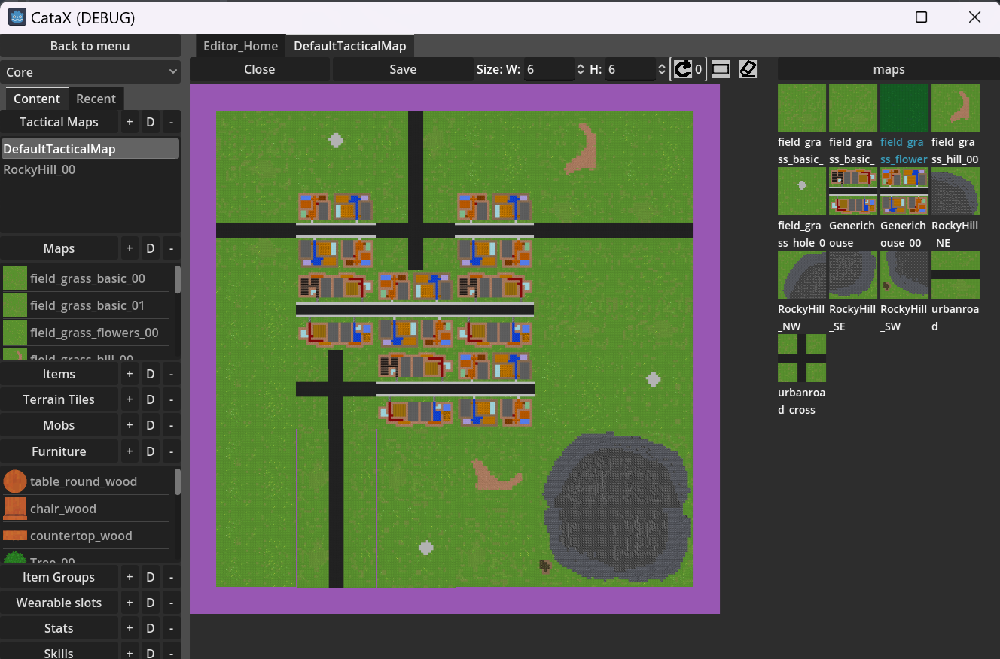

### Map editor
A map has a fixed size of 32x32 and has a maximum of 21 levels in height, ranging from -10 to +10. 
- Place tiles, mobs and furniture onto the grid and get creative
- Controls allow you to move up and down, zoom, rotate, copy/paste and more
- Compose a custom brush with the Brush Composer, aiding in quick (randomized) terrain painting.

Define areas on the map to allow more randomization:

Use the map preview to balance the areas and adjust the randomization. Hit the generate button multiple times to visualize the spawn chance and area coverage:
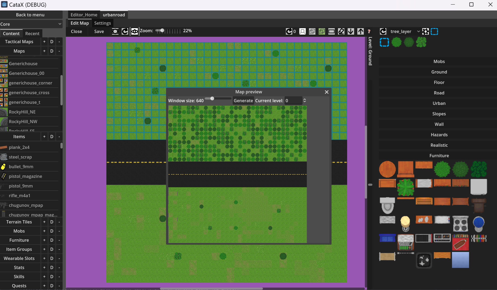

With the area editor, you can finetune the area to your liking. Set the proportions of tiles, set the spawn chance and exclude other areas from spawning. You can also rename the area and enable random rotation:

	

### Item editor
Allows you to edit and add items in the game. An item will work as you configure it. You can make it work as a weapon and as food if you choose to, the types are not mutually exclusive. Specify the item properties in the convenient editor which has tooltips and controls to help you fill in the right values.

One item can have any number of crafting recipes. Use the crafting recipe editor to specify the requirements for this item. To add items to the recipe, drag them from the left side of the window onto the recipe!

### Tile editor
Allows you to specify the properties of tiles and add new ones. Sprites are loaded from /mods/core/tiles so put your sprites there if you want to add new ones.

### Mob editor
Allows you to create new mobs and configure them. You can then use the map editor to place them on the map.

# Furniture editor
Create new furniture or edit existing ones with this editor. After creating them, you can place them on the map with the Map Editor. Hover over the controls to get information about each of them.

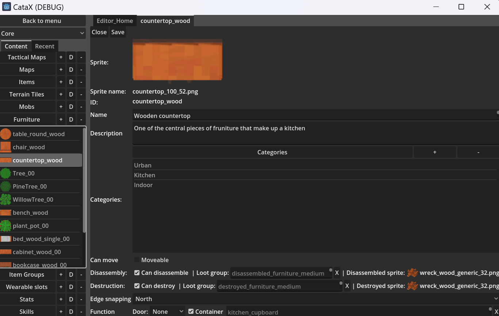

# Itemgroup editor
Specify itemgroups, used to spawn items in various locations including containers and corpses. By specifying a spawn chance and amount, it offers a wide veriety of possibilities. To add items to the itemgroup, drag them from the left side of the screen onto the itemgroup!

# Player attribute editor
In line with complete moddability, you can set the player's attributes using the editor. This allows for more immersion and customization. Once the attribute is created, you can then drag them from the menu onto items and have them alter the attribute. For example, you can have an "apple" item increase the "food" attribute when used.

# Wearable slots editor
Ever wanted to create that unique piece of armor, but didn't have that slot to fit it in? Now you can add your own slots. These show up in the player's inventory and enables the player to equip armor into it.

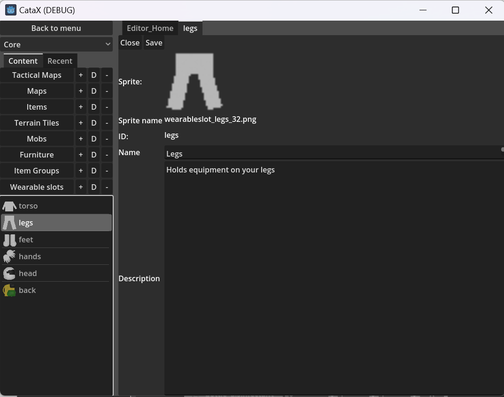

# Stats editor
Add your own stats to the game. Stats are not implemented yet, but you can define them.

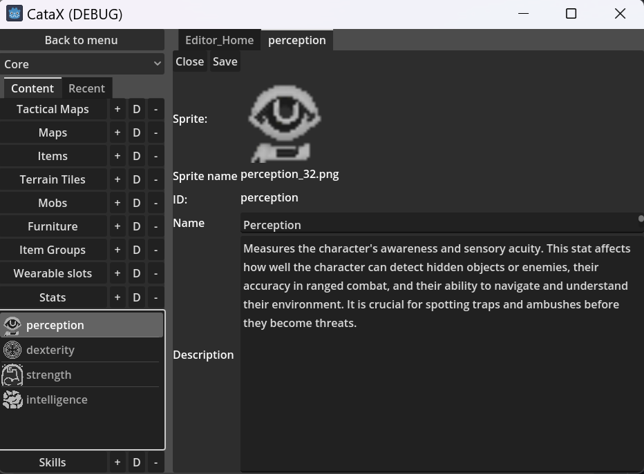

# Skills editor
Make any and every skill you need! Some are included in the core mod, but you can easily add your own in the Skills Editor. After they are created, use them in weapon or recipe configuration for other entities.

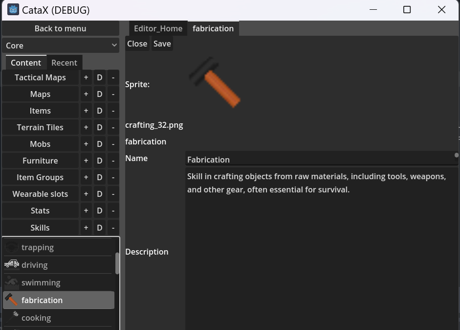

# Quests editor
Create a story for the player using the quest editor. These will show up in the quest journal in-game. It allows you to guide the player to their next destination and reward them for their efforts. There are multiple step types available. You can set many details and add a tip for the player.

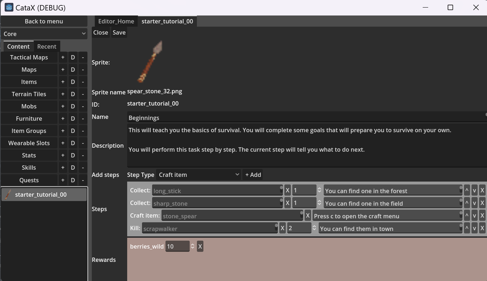

## Roadmap

### Stage 1 (first release):

- Building ~~/crafting/reloading~~ should take resources from the inventory
- Basic ~~crafting/~~ building menu
- ~~"Progress bar" to show the player when the current action will be finished (reloading, building, crafting etc.)~~
- A few additional weapons
- ~~In-game content editor to make our own mods or contribute to the core mod~~
- ~~Doors~~
- Sounds
- Bug fixing
- Polishing

Additional features before our first release:

- ~~furniture/containers~~
- personal goals
- more enemies/better AI
- noise
- some fancy shaders?
- equipment
- proper player inventory, bags, pockets etc.

### Stage 2:

- Vehicles
- Proper base building
- Base raids?
- ~~World map~~
- ~~Saving~~
- Player stats and skills
- ~~Melee weapons~~
- ~~Recoil/sway/spread/aiming~~

## Contribute

If you like Godot and want to contribute, feel free to submit a pull request or issue on your ideas, or join us on discord. To make edits, start by reading the [getting started guide](https://github.com/Khaligufzel/Dimensionfall/blob/main/Documentation/Game_development/Getting_started.md). This is and always will be a hobby project and will not be for sale. 

## Community

Official Discord:
[https://discord.gg/yzrxG9zZqA](https://discord.gg/yzrxG9zZqA)

## Credits:
- Sprites: Some sprites were created with https://github.com/int-ua/blender-pixelart
- Sprites: Some sprites were created with https://github.com/RodZill4/material-maker
- Inventory: This game uses https://github.com/peter-kish/gloot to implement the inventory
- Text display: Some UI uses https://github.com/daenvil/MarkdownLabel for text display
